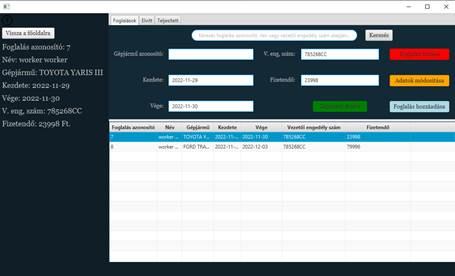
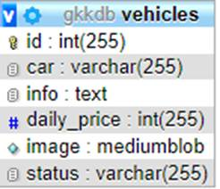

SZENT ISTVÁN KATOLIKUS  
TECHNIKUM ÉS GIMNÁZIUM

**Balogh Dávid**

**Füredel Valentin Szilveszter**

**Tarnóczi Levente Tibor**

**Gépjárműkölcsönzés**

**SZOFTVERFEJLESZTÉS ÉS -TESZTELÉS VIZSGAREMEK**

Sátoraljaújhely, 2022

  

**TARTALOMJEGYZÉK**

Tartalom

[Bevezetés. 3](#Bevezetés)

[Felhasználói Dokumentáció. 4](#Felhasználói Dokumentáció)

[Rendszerkövetelmény. 4](#Rendszerkövetelmény)

[Hardver követelmények: 4](#Hardver követelmények:)

[Szoftver követelmények. 4](#Szoftver követelmények)

[Telepítés menete. 5](#Telepítés menete)

[Adatbázis hozzáadása. 5](#Adatbázis hozzáadása)

[Weboldal telepítés menete: 6](#Weboldal telepítés menete:)

[Java alkalmazás telepítése: 6](#Java alkalmazás telepítése:)

[Szoftver használata. 8](#Szoftver használata)

[Web alkalmazás használata. 8](#Web alkalmazás használata)

[Java alkalmazás használata. 14](#Java alkalmazás használata)

[Fejlesztői dokumentáció. 22](#Fejlesztői dokumentáció)

[Az alkalmazott fejlesztői eszközök. 22](#Az alkalmazott fejlesztői eszközök)

[Trello projektkezelő. 22](#Trello projektkezelő)

[Git verziókezelő. 22](#Git verziókezelő)

[XAMPP. 23](#XAMPP)

[Microsoft Visual Studio Code. 23](#Microsoft Visual Studio Code)

[IntelliJ IDEA.. 24](#IntelliJ IDEA)

[Microsoft Office Word. 24](#Microsoft Office Word)

[Adatmodell leírása. 25](#Adatmodell leírása)

[user tábla. 25](#user tábla)

[vehicles tábla. 25](#vehicles tábla)

[booking tábla. 26](#booking tábla)

[message tábla. 26](#message tábla)

  

# Bevezetés

Azért választottuk ezt a szakmát, mert régóta érdeklődünk szoftverfejlesztéssel kapcsolatos témák iránt. Vannak olyan kihívások, amik felkeltik a figyelmünket például összetettebb rendszerek készítése és működése. Később szeretnénk ebben a szakmában elhelyezkedni, tevékenykedni vagy továbbtanulni.

Az utóbbi években kis városunkban megnőtt a turizmus és ennek köszönhetően megnőtt a gépjármű bérlésre az igény.

A mi projektünk célja, hogy a hétköznapi emberek számára könnyebbé és egyszerűbbé tegye a gépjármű bérlés lehetőségét, a cégek számára könnyebbé és átláthatóbbá tegye a gépjárművek nyilvántartását és a bérlések kezelését.

Azért választottuk ezt a témát mivel érdeklődünk a személy-gépkocsik iránt. Korábbi autóbérlésünk során találkoztunk néhány nehézséggel, így szeretnénk megkönnyíteni a városba érkező turisták vagy helyiek, vagy környékbeliek közlekedési problémáit, egyúttal egy vállalkozás munkáját, ami bérbeadással foglalkozik.

A projekt elkészítése során a következő programozási nyelveket használtuk: Java, PHP, MySQL, HTML, CSS, JavaScript.

  

# Felhasználói Dokumentáció

## Rendszerkövetelmény

### Hardver követelmények:

Minimális rendszerkövetelmény:

            **Operációs rendszer:** Windows 10/Linux/MacOS

            **Processzor:** 1 GHz vagy gyorsabb

            **RAM:** 1 GB

            **Merevlemez**\-**terület:** 1 GB

            **Videókártya:** A DirectX 9-es vagy újabb verziójával kompatibilis.

            **Kijelző:** 800x600

Ajánlott rendszerkövetelmény:

            **Operációs rendszer:** Windows 10/Linux/MacOS

            **Processzor:** 2 GHz vagy gyorsabb

            **RAM:** 2 GB

            **Merevlemez-terület:** 1 GB

            **Videókártya:** A DirectX 9-es vagy újabb verziójával kompatibilis.

            **Kijelző:** 1280x1024

### Szoftver követelmények

·         XAMPP  v3.3.0

·         PHP v8.1.6

·         Java Runtime Enviroment(JDK) 11.0.14

  

## Telepítés menete

### Adatbázis hozzáadása

Indítsa el a xampp-ot, ha nincs feltelepítve a számítógépre, akkor telepítse a v3.3.0 verzió számú vagy újabb programot, amely 8.1.6 vagy újabb php-val rendelkezik. A telepítésének folyamata a telepitő állomány megnyitásával kezdődik, majd ha végzett a telepítés indítsa el az Apache és a MySQL szervert. Ez az adatbázis FONTOS a weboldal és a java alkalmazás futtatásához is!

0‑1. XAMPP Control Panel v3.3.0

Nyisson meg egy böngészőt (pl.: Google Chrome) és lépjen be a phpMyadmin szerverére a [http://localhost/phpmyadmin/](http://localhost/phpmyadmin/) címmel. Hozza létre a következő adatbázist ’**_gkkdb_**’ néven, a karakter kódolása utf8\_hungarian\_ci legyen.

0‑2. Adatbázis létrehozása

Nyissa meg a létrehozott adatbázist (gkkdb) és kattintson az **_import_** fülre. Kattintson a fájl kiválasztására, majd válassza ki a _GKKAPP/adatbázis_ mappából a _gkkdb.sql_ fájlt és kattintson az **indítás** gombra.

0‑3. Adatbázis importálása

### Weboldal telepítés menete:

A weboldal feltelepítése előtt keresse meg a _xampp/htdocs_ nevű mappát, majd törölje annak minden tartalmát, ha ez megtörtént helyezze a _GKK WEB_ mappa tartalmát a törölt fájlok helyére. Írja be a keresőmezőbe a _localhost_ címet és élvezze weboldalunk nyújtotta szolgáltatásokat.

### Java alkalmazás telepítése:

#### Windows indítás:

Töltse le a git reposytort ([https://github.com/Florex001/GKKApp](https://github.com/Florex001/GKKApp)). Majd csomagolja ki egy tetszőleges helyre. Indítsa el a „**_GKKApp\_win.exe_**” fájlt és próbáljon meg bejelentkezni. Ellenőrizze, hogy elérhető-e az adatbázis, ha nem akkor hajtsa végre az „Adatbázis hozzáadása” című fejezetben leírtak szerint az adatbázis létrehozását. Ha nincs, létrehozva az adatbázis ezt a hibaüzenetet fogja látni:

0‑4. Hiba üzenet Java

#### Arch Linux  indítása:

Töltse le a git reposytort([https://github.com/Florex001/GKKApp](https://github.com/Florex001/GKKApp)). Majd csomagolja ki egy tetszőleges helyre. Indítsa el a „**_Gkkapp\_linux.jar_**” fájlt és próbáljon meg bejelentkezni. Ellenőrizze, hogy elérhető-e az adatbázis, ha nem akkor hajtsa végre az „Adatbázis hozzáadása” című fejezetben leírtak szerint az adatbázis létrehozását. Ha nincs, létrehozva az adatbázis ezt a hibaüzenetet fogja látni:

0‑5. Hiba üzenet Java

#### Debian Linux indítása:

Töltse le a git reposytort([https://github.com/Florex001/GKKApp](https://github.com/Florex001/GKKApp)). Majd csomagolja ki egy tetszőleges helyre. Majd a projekt mappájában nyisson meg egy terminált. A terminálban írja be a következő parancsot: „_java –jar Gkkapp\_linux.jar”_. Nyomjon egy entert és már el is indul a program, Próbáljon meg bejelentkezni. Ellenőrizze, hogy elérhető-e az adatbázis, ha nem akkor hajtsa végre az „Adatbázis hozzáadása” című fejezetben leírtak szerint az adatbázis létrehozását. Ha nincs, létrehozva az adatbázis ezt a hibaüzenetet fogja látni:

6. Hiba üzenet Java

## Szoftver használata

### Web alkalmazás használata

0‑7. Kezdőlap

#### Általános információk

A weboldalunk olyan szolgáltatást nyújt, amelyen keresztül személygépjárműveket lehet bérelni. Az oldal fejlesztéséhez Google Chrome böngészőt használtunk, de más böngészőkkel is működik. A gépjárművekhez általános leírás is tartozik valamint a bérlés napi díjáról is kap tájékoztatás a felhasználó. A gépjárművek között lehet keresni, erre szolgál a weboldalba beépített keresőmotor. Ezen felül a felhasználó tudja rendezni a gépjárműveket _„Ár szerint növekvő”_ és _„Ár szerint csökkenő”_ sorrendbe a szűrő legördülő menü segítségével. A bérlés megkezdéséhez felhasználói fiókra van szükség.

#### Gépjárművek elrendezése

0‑8. Gépjármű kártya

A gépjárművek kártyákban vannak elhelyezve a kezdőlapon. Ezek elrendezése négyzetrács szerűen van megoldva. A kártyák tartalmaznak egy képet a gépjárműről, egy címet, ami a gépjármű neve, egy leírást a gépjárműről és a gépjármű napi árát. Ezek mellett megtalálható egy foglalás nevű gomb is, amely átnavigálja a felhasználót a gépjármű foglalás oldalra, amelyhez bejelentkezés szükséges.

#### Regisztráció és Belépés

0‑9. Regisztráció

Ahhoz hogy a felhasználó regisztrálni tudjon, ki kell választania az egyik gépjárművet majd a foglalás gombra kattintani (Regisztráció vagy Bejelentkezés esetén nem kerül foglalásra az adott gépjármű!). Majd át navigálja a weboldal a felhasználót hogy _„A tartalom megtekintéséhez bejelentkezés szükséges”_. Ha rendelkezik felhasználói fiókkal jelentkezzen be. Ha nincs még felhasználói fiókja, akkor kattintson a _„Nincs még felhasználói fiókod? Regisztráció”_ Regisztráció linkre. Ha rákattintott, akkor az oldal automatikusan átnavigálja a regisztráció oldalra, ahol minden adat megadása kötelező.

0‑10. Bejelentkezés

A bejelentkezésnél Felhasználónév és Jelszó megadása kötelező. Ha sikeres a bejelentkezés egy sütit fogunk eltárolni a böngészőjében. Ha sikeres a bejelentkezés, akkor a kiválasztott gépjárműnek a foglalás oldala fog megjelenni. Illetve a navigációs sávban megjelenik a kijelentkezés gomb, amire ha rá kattintunk, akkor törlődik az eltárolt süti és új bejelentkezésre lesz szüksége és még megjelenik a foglalásaim fül is ahol a felhasználó meg tudja tekinteni a gépjármű foglalásait. Profil oldal is elérhetővé vállik onnan ismerhető fel, hogy a felhasználónév lesz a neve annak a menünek.

#### Gépjármű foglalása

0‑11. Gépjármű foglalás

Ha sikeresen bejelentkezett, akkor foglalás oldal fog megjelenni a kiválasztott autójával. Ha biztos benne hogy azt az autót szeretné lefoglalni, akkor töltse ki az alábbi mezőket valós adatokkal:

0‑12. Adatok megadása foglaláshoz

13. FOGLALÁSI HIBA ÜZENET
Ha biztos benne hogy arra az időpontra szeretné kibérelni az adott gépjárművet és a vezetői engedélyszáma valós, akkor kattintson a **_Foglalás_** gombra. Ha sikeres a foglalás, akkor át navigálja a **_foglalásaim_** oldalra. Ha nem megfelelő a foglalás, akkor hiba üzenetet fog kapni: Például.:

#### Foglalásaim oldal

0‑14. Foglalásaim menüpont

A foglalásaim menüpontra kattintva, vagy ha éppen foglalt egy gépjárművet és átnavigálásra került, akkor a saját foglalásait fogja látni. A foglalását csak a gépjármű átadásának idejéig fogja látni. Ha már a gépjárművet használja, amit bérel, abban az esetben már nem fogja látni foglalását. Fizetés gépjármű átadása előtt történik a telephelyen készpénzzel vagy bankkártyával. Amennyiben módosítani akarja foglalását akkor a navigációs menüben kattintson az **_Elérhetőségek_** menüpontra. Azt fogja tapasztalni, hogy az oldal aljára, fogja navigálni ahol, megjelennek a céggel kapcsolatos elérhetőségek. Módosításhoz hívja fel az ott található telefonszámot vagy írjon emailt. Foglalás lemondására az oldalon van lehetőség.

0‑15.Foglalás megjelenése

A saját foglalása a _0-15.Foglalás megjelenése_ ábrának megfelelően fog megjelenni. Ebben látni fogja a foglalás azonosítóját, amit jegyezzen meg, mert fontos a gépjármű bérlése során. Ezen kívül megjelenik még a gépjármű neve, Foglalás kezdete, Foglalás vége illetve a teljes ár. A teljes ár a két megadott dátum közötti napok száma szorozva napi árral. A **_Foglalás lemondása_** gomb is itt jelenik meg, ha le akarja mondani a foglalását nincs más dolga csak rá kattintani.

#### Profil oldal

0‑16. Profil oldal

A profil oldalon megjelenik egy profilkép, a felhasználónév, a felhasználó vezetékneve és keresztneve, az e-mail címe illetve a regisztráció időpontja. Láthatunk egy módosítás gombot is amely arra a célra szolgál, hogy ha módosítani szeretnénk az adatokat, akkor erre ad lehetőséget.

0‑17. Adatok Módosítása

Az adatok csak külön-külön változtathatók meg. A felhasználónév, az e-mail cím, a telefonszám és a jelszó módosítható. A jelszót csak a régi jelszó tudatában tudja módosítani és az új jelszónak és az újra mezőnek egyeznie kell. Ha a vezetékneve és keresztneve változott vegye fel velünk a kapcsolatot e-mail címen.

### Java alkalmazás használata

#### Általános Információk

A Java alkalmazásban a dolgozók a foglalásokkal és a gépjárművekkel kapcsolatos információkat tudják kezelni. Ha a felhasználó jogosultsága admin akkor megtekinthető számára az admin felület is. Ezen felül a dolgozó és az admin számára is megtekinthető az céginformációk, üzenet küldés és a saját profiljának adatai.

#### Bejelentkezés

A bejelentkezéshez már egy létező felhasználó szükséges aminek _„worker”_ vagy _„admin”_ jogosultsága van. Írja be a felhasználónevét és jelszavát majd kattintson a **Bejelentkezés** gombra. Ha nincs megfelelő jogosultsága kérjen meg egy dolgozót, hogy vegye fel a kapcsolatot az adminisztrátorral.

****

18. Bejelentkezés

#### Főoldal

A főoldalon megtalálható a felhasználónév, **Foglalások**, **Gépjárművek**, **Cégről**, **Üzenet küldés**, **Profil** és egy **Kijelentkezés** gomb.

19. Főoldal

  

#### Foglalások

A foglalások menüpontban megtalálható az összes foglalás, a foglalásokról az összes adat, egy **Vissza a főoldalra** egy gomb. Ezek között megfigyelhető egy táblázat is ahol megjelenik az összes foglalás. Illetve a foglalások között tud keresni is, továbbá tud foglalást törölni, módosítani és hozzáadni. Tudja a kiválasztott foglalás státuszát is módosítani a **Gépjármű átadva** gombbal.

20. Foglalások oldal

A státuszát akkor kell módosítani, hogyha átadásra került a bérlő számára a gépjármű. Ezek után az elvitt menüpontba át fog kerülni a kiválasztott foglalás. A **Sikeres foglalás** gombra akkor kattintson, ha az adott gépjármű foglalása végbe ment.

21. Elvitt menüpont

  

A Teljesített menüponton megtalálható az összes végbement foglalás és annak összes adata.

22. Teljesített menüpont

#### Gépjárművek

A gépjárművek oldalon megtalálható egy táblázatban az összes gépjármű amelyek között lehet keresni és a kiválasztott gépjárművet lehet módosítani vagy törölni. Módosításnál csak a gépjármű nevét, információját, és napi árát lehet módosítani.

23. Gépjárművek oldal

Ahhoz hogy gépjárművet tudjon hozzáadni, írja be először a gépjármű nevét, információját és a napi árát a beviteli mezőkbe majd kattintson a **Hozzáadás** gombra. Ezután egy fájlkezelő ablak fog megnyílni ahol kiválaszthatja, a gépjárműről a képet majd kattintson a **Megnyitás** gomra. Fog kapni egy felugró üzenet, ha sikeres a hozzáadás.

24. Fájlkezelő

#### Cégről

A **Cégről** gombra kattintva egy felugró ablak jelenik meg, amelyben megtalálható a cégről az összes információ, mint például Regisztrációs szám, Cégnév, Székhely és Adószám.

25. Céginformációk

#### Üzenet küldés

Az üzenet küldés oldalon írhat üzenetet az adminisztrátornak, hogyha valamelyik felhasználónak jogosultságot kell adni vagy elvenni illetve különböző profilmódosításokat lehet kérvényezni. Ha megírta az üzenetét akkor kattintson a **Küldés** gomra. Ezeket az adminisztrátor el tudja fogadni vagy el tudja utasítani az üzentet. Az elfogadásról vagy az elutasításról nem fog értesítést kapni.

26. Üzenet küldés ablak

#### Profil

A profil oldalon meg tudja tekinteni az összes felhasználói adatát, mint például felhasználónév, e-mail cím, telefonszám, nevét, regisztráció dátumát illetve jogosultságát. Ha rákattint a **Jelszó megváltoztatása** gombra megjelenik egy beviteli mező, amelybe beírhatja új jelszavát, ha beírásra került kattintson az **OK!** gombra.

27. Profil oldal

Abban az esetben, ha jogosultsága _admin_ akkor az oldalon a **Kijelentkezés** gomb alatt megjelenik egy **Admin** gomb, amely átirányít az alkalmazás adminisztrátori felületére.

  

Az adminisztrátori felület hasonlít a **Főoldalhoz** . Itt megtekinthetőek az **Értesítések**,

**Felhasználók** és egy **Kilépés** gomb.

28. Értesítések

Az Értesítések fülön megtekinthetők azok az üzenetek amiket a dolgozók írnak. Az Értesítéseknél olyan üzeneteket fogadhatnak el amelyek felhasználó módosítással kapcsolatosak(Jelszót az adminisztrátor se tud változtatni). Amely kérés nem felel meg ennek azt az adminisztrátornak el kell utasítania. Az **Üzenetek** fülön kívül megtalálható egy **Elfogadva** fül ahol az elfogadott üzenetek találhatóak és egy **Elutasítva** fül ahol az elutasított üzenetek találhatóak.

29. Felhasználók

A Felhasználók fülön egy táblázatban fel van sorolva az összes felhasználó. A táblázat alatt  egy kereső mező amelyben kereshet felhasználónév, név vagy email alapján a felhasználók között .A kereső mező alatt vannak beviteli mezők. Itt tudja beírni a kívánt adatokat. A beviteli mezők alatt található egy **Törlés** gomb, amely a táblázatban kiválasztott felhasználót tudja törölni, egy **Módosítás** gomb, amivel a táblázatban kiválasztott felhasználó adatait tudja módosítani kivéve az azonosítót, a jelszót és a regisztrációs idejét. Felhasználót is lehet létrehozni , ezt a **Hozzáadás** gombbal tudja megvalósítani miután az összes beviteli mező kitöltésre került kivéve az azonosítót és a regisztrációs időt ugyanis ezeket a rendszer automatikusan tölti ki. A **Kilépés** menüpont vissza lépteti a **Főoldara**. Kijelentkezni a felhasználójából a Főoldalon a Kijelentkezés menüpont segítségével tud kilépni a fiókjából vagy **Profil** menüpontban a jobb felső sarokban a **Kijelentkezés** gombra kattint. Ez vissza irányítja a bejelentkezés felületre.

  

# Fejlesztői dokumentáció

## Az alkalmazott fejlesztői eszközök

### Trello projektkezelő

A csapatunk a Trello nevű projektkezelőt használta. A Trello megkönnyíti a projektek és feladatok kezelését a csapatok számára. A Trello olyan vizuális eszköz, amely segítette a csapatunk projektjének munkafolyamatát és segített a feladatkövetés kezelésében.

30.Trello Ikon

### Git verziókezelő

A Git egy ingyenes és nyílt forráskódú elosztott verziókezelő rendszer, amely a kicsitől, a nagyon nagy projektig mindent gyorsan és hatékonyan kezel. A csapatunk a Github rendszerét választotta. Alapvetően is ezt a verziókezelőt használtuk volna. Saját funkcióin felül a Git elosztott verziókövetését és forráskódkezelését (SCM) teszi elérhetővé. Hozzáférés-kezelést és számos együttműködési funkciót nyújt, mint például bug követés, szolgáltatáslekérés, feladatkezelés, valamint wikiket minden projekthez.

31. GitHub

### XAMPP

Azért a XAMPP adatbázis kezelőt választottuk, mert a PHP weboldalunknál nagy segítséget nyújtott ennek a használata. Ez egy szabad és nyílt forrású platformfüggetlen webszerver-szoftvercsomag, amelynek legfőbb alkotóelemei az Apache webszerver, valamint a PHP programozási nyelv értelmezője.

32. XAMPP

### Microsoft Visual Studio Code

Azért a Visual Studio Code-ot használtuk, mert ezt találtuk a legalkalmasabbnak mivel, sokféle programnyelvet és a Git verzió kezelését is támogatja. Ezen kívül számtalan hasznos bővítmény elérhető hozzá. A Visual Studio Code ingyenes, nyílt forráskódú kódszerkesztő, melyet a Microsoft fejleszt Windows, Linux és OS X operációs rendszerekhez. Támogatja a hibakeresőket, továbbá képes az intelligens kódkiegészítésre az IntelliSense segítségével.

33. Microsoft Visual Studio Code

  

### IntelliJ IDEA

Azért az IntelliJ IDEA-t használtuk, mert ez nyújtja a legnagyobb segítséget a JAVA alkalmazás fejlesztése közben. Az alkalmazást 11.0.14-es verzió számú JDK-val fejlesztettük. Az IntelliJ IDEA egy intelligens, a Java programkód írására alkalmas IDE a Java és más JVM-nyelvek, például a Kotlin, a Scala és a Groovy használatához mindenféle alkalmazáson. Az IntelliJ IDEA bővíthető a JetBrains által fejlesztett ingyenes bővítményekkel, amelyek lehetővé teszik más programozási nyelvekkel való együttműködést. Az IDE (Integrált fejlesztői környezet), olyan szoftver alkalmazás, amely átfogó létesítményeket biztosít a számítógépes programozók számára a szoftverfejlesztéshez.

34. IntelliJ IDEA

### Microsoft Office Word

A dokumentáció megírásához a Microsoft Office csomagban található Microsoft Word-öt használtuk. A megbízható Word alkalmazás segítségével gyorsan és egyszerűen létrehozhatja, szerkesztheti, megtekintheti és megoszthatja fájljait másokkal.

35. Microsoft Office Word

## Adatmodell leírása

A projektünkhöz használt adatbázisnak a neve „gkkdb”. Ez az adatbázis 4 táblából áll, ezeknek a neve user, vehicles, bookings és message. Ezek között a táblák között kapcsolatok lettek kialakítva. Az adatbázis szerver futtatásához XAMPP szervert használtunk.

### user tábla

36. USER TÁBLA

A(z) user táblába a felhasználó adatit tároljuk. A táblában 9 féle adatot tárolunk. Az első az **id**, amely egy azonosító, ami automatikusan kapja, az értékét minden egy regisztrációnál egyel nő a kapott érték. Ez az elsődleges kulcs a táblában. A(z) **username** a felhasználó fantázia neve. Ez a tábla másodlagos kulcsa. A **first\_name** és a **last\_name** a felhasználó keresztneve és vezetékneve. A **password** a felhasználó belépésekor az azonosításhoz szükséges jelszó. Az **email** és a **phone\_number** a felhasználó elektronikus levél címe és telefonszáma. A **registration\_date** (éééé-hh-nn) tárolja, hogy mikor regisztrált a felhasználó. Ez automatikusan tölti fel az adatot az aktuális dátummal. A **rank** a felhasználó jogosultságát tárolja, ezek lehetnek a(z) _user_, a _worker_ és az _admin_.

### vehicles tábla

37. VEHICLE TÁBLA

A vehicles táblában a gépjárművek kerülnek tárolásra. Az id az elsődleges kulcs és ez az azonosítója az eltárolt gépjárműveknek. A **car** oszlopban tároljuk a gépjárművek pontos nevét. Az **info** nevű oszlopban tároljuk az adott autó leírását. A **daily\_price** nevű oszlopban van eltárolva a gépjármű napi ára forintban. Az **image** nevű oszlopban tároljuk a képeket amely **_mediumblob_** formátumban van eltárolva. A kép maximális mérete 16 MB lehet. A **status** a gépjármű aktuális állapotát tárolja el melyek a következők lehetnek, _foglalva_ és _elérhető_.

### booking tábla

38. BOOKINGS TÁBLA

A bookings táblába a felhasználók gépjármű foglalásait tároljuk. Az első az **id**, amely egy elsődleges kulcs foglalás azonosítója. Ez az érték minden foglalásnál egyel nagyobb lesz . A(z) **user\_id** egy idegen kulcs amely a(z) **user** táblából kapja meg a felhasználó azonoítóját. A **borrowed\_vehicle\_id** is egy idegen kulcs ami a **vehicle** táblából kapja meg a gépjármű azonosítóját. A **borrow\_start** és a **borrow\_end** azok a dátumokat tárolja amelyet a felhasználó megad a foglaláskor , innentől kezdődik meg a gépjármű bérlése és fejeződik be. Ezeknek a formátuma éééé-hh-nn. A **driver\_license\_number** a felhasználó vezetői engedély száma amit a foglalásnál ad meg. A **price** az a bérlés megkezdése és a bérlés vége közötti különbség szorozva gépjármű napi árával forintba. A **status** a foglalásnak a státusza amelyek a következők lehetnek, _foglalva_, _elvitte_ és a _teljesítve_.

### message tábla

39. MESSAGE TÁBLA

A message tábla azért jött létre, mert az alkalmazásban a worker jogosultsággal bíró felhasználók üzenetet tudjanak küldeni az admin jogosultsággal rendelkező felhasználónak. Az **id** az elsődleges kulcs, ami az üzenet azonosítója. A(z) **user\_name** egy idegen kulcs, ami a(z) user tábla username oszlopával kapcsolódik. A **name** a felhasználó vezetékneve és keresztneve. A **message** oszlopban tárolódik el az üzenet tartalma. A **status** az üzenet státusza, amelyek a következők lehetnek, _elküldve_, _elfogadva_ vagy _elutasítva_.

  

### Táblák közötti kapcsolatok

A(z) _user_ tábla **id** oszlopa csatlakozik a _booking_ tábla **user\_id** oszlopához mivel a foglaláskor a felhasználót az **id** alapján azonosítjuk. Illetve a(z) **username** kapcsolódik a _message_ tábla **user\_name** oszlopához mivel a küldött üzenetnél megjelenítjük azt a felhasználót, amelyik küldte az üzenetet. A _vehicle_ tábla **id** oszlopa kapcsolódik a _bookings_ tábla **borrowed\_vehicle\_id** oszlopához mivel tároljuk a foglalásnál a felhasználót, aki foglalta és a foglalt gépjárművet is.

40. Táblák közötti kapcsolat

  

## Részletes specifikáció

### Weboldal részletes specifikációi

#### Adatbázis csatlakozása

function getConnection()

{

    return new pdo(

        'mysql:host=' . $\_SERVER\['DB\_HOST'\] . ';dbname=' . $\_SERVER\['DB\_NAME'\],

        $\_SERVER\['DB\_USER'\],

        $\_SERVER\['DB\_PASSWORD'\]

    );

}

A **getConnection()** függvényünk vissza ad egy pdo-t, amely kapcsolódik a szerverhez. Az adatokat egy **_.htaccess_** fájlból kéri le. A későbbiekben ezzel a függvénnyel lehet csatlakozni az adatbázishoz.

#### Regisztráció

##

function registrationhandler()

{

    $rank \= "user";

    $pdo \= getConnection();

    $statement \= $pdo\->prepare("SELECT username FROM user WHERE username \= ?");

    $statement\->execute(\[$\_POST\["username"\]\]);

    $user \= $statement\->fetch(PDO::FETCH\_ASSOC);

    _if_ ($user) {

        header('Location: ' . getPathWhitId($\_SERVER\['HTTP\_REFERER'\]) . '&info=regisztracioSikertelen');

        _return_;

    }_else_ _if_($\_POST\["username"\] \=== "" ||  $\_POST\["keresztnev"\] \=== "" || $\_POST\["vezeteknev"\]\==="" || $\_POST\["jelszo"\]\==="" ||$\_POST\["email"\] \==="" || $\_POST\["telefonszam"\]\===""){

        header('Location: ' . getPathWhitId($\_SERVER\['HTTP\_REFERER'\]) . '&info=regisztracioSikertelen');

        _return_;

    }_else_{

        $statement \= $pdo\->prepare("INSERT INTO \`user\` (\`id\`, \`username\`, \`first\_name\`, \`last\_name\`, \`password\`, \`email\`, \`phone\_number\`, \`registration\_date\`, \`rank\`)

        VALUES (NULL, ? , ? , ? , ? , ? , ? , ? , ?)");

        $statement\->execute(\[

            $\_POST\["username"\],

            $\_POST\["keresztnev"\],

            $\_POST\["vezeteknev"\],

            $\_POST\["jelszo"\],

            $\_POST\["email"\],

            $\_POST\["telefonszam"\],

            date("Y-m-d"),

            $rank

        \]);

        header('Location: ' . getPathWhitId($\_SERVER\['HTTP\_REFERER'\]) . '&info=regisztracioSikeres');

    }

}

##

A regisztráció csak a weboldalon végezhető el. Létrehozzuk a kapcsolatot az adatbázissal a **getConnection()** függvény segítségével, majd az adatbázisból lekérdezzük a(z) _username_ adatot a(z) **_user_** táblából és összehasonlítjuk a beviteli mezőbe beírt felhasználónévvel. Ha létezik már olyan felhasználónév, akkor hiba üzenetet kapunk és ellenőrzi, hogy a beviteli mezők ki lettek-e töltve. Ha nem talált hibát, akkor feltöltésre kerül a(z) **_user_** tábla adatokkal. A dátumot és a rankot a program automatikusan határozza be. Sikeres regisztráció esetén az oldal átnavigálja a bejelentkezéshez.

##

#### Bejelentkezés

##

function loginhandler()

{

    $pdo = getConnection();

    $statement = $pdo\->prepare("SELECT \* FROM user WHERE username \= ? ");

    $statement\->execute(\[$\_POST\["username"\]\]);

    $user = $statement\->fetch(PDO::FETCH\_ASSOC);

    if (!$user) {

        header('Location: ' . getPathWhitId($\_SERVER\['HTTP\_REFERER'\]) . '&info=hibasadatok');

        return;

    }

    if (!($\_POST\['password'\] === $user\["password"\])) {

        header('Location: ' . getPathWhitId($\_SERVER\['HTTP\_REFERER'\]) . '&info=hibasadatok');

        return;

    }

    $\_SESSION\['userID'\] = $user\['id'\];

    $\_SESSION\['username'\] = $user\['username'\];

    header('Location: ' . getPathWhitId($\_SERVER\['HTTP\_REFERER'\]));

}

##

A **getConnection()** függvénnyel kapcsolatot létesítünk az adatbázissal, majd lekérdezzük a(z) **_user_** táblából a(z) _username_\-t , amit a felhasználó megadott. Ha nem talál olyan felhasználót, akkor hibaüzenetet kapunk. Ha talált olyan felhasználót de, a megadott jelszó és a tárolt jelszó nem egyezik, akkor is hiba üzenetet fogunk kapni. Megegyező adatok esetén cookie-t tárolunk el a böngészőjében, amely tartalmazza az adott felhasználó _id_\-át és a _username_\-t. Majd ahonnan indította a bejelentkezést, oda fogja navigálni az oldal de, már bejelentkezve.

##

#### Főoldal

##

function homePage()

{

    $elerheto = 'elerheto';

    $nemelerheto = 'nem\_elerheto';

    $pdo = getConnection();

    $statement = $pdo\->prepare('SELECT \* FROM \`vehicles\` WHERE status \= ?');

    $statement\->execute(\[$elerheto\]);

    $cars = $statement\->fetchAll(PDO::FETCH\_ASSOC);

    $statement = $pdo\->prepare('SELECT \* FROM \`vehicles\` WHERE status \= ?');

    $statement\->execute(\[$nemelerheto\]);

    $nocars = $statement\->fetchAll(PDO::FETCH\_ASSOC);

    echo compileTemplate("wrapper.phtml", \[

        'content' => compileTemplate('cars.phtml', \[

            'cars' => $cars,

            'nocars' => $nocars

        \]),

        'bejelentkezve' => isLoggedIn()

    \]);

}

##

A **getConnection()** függvénnyel kapcsolatot létesítünk az adatbázissal, majd lekérdezzük az összes olyan autót, amelynek a státusza elérhető. Majd ezután lekérdezzük a nem elérhető gépjárműveket is. Ha rákattintanak a foglalás gombra és be vannak jelentkezve, akkor átnavigálja önöket az adott autó oldalára, ahol leadhatják foglalásaikat. Ha nincsen bejelentkezve, akkor a bejelentkezés oldal fog megjelenni.

##
